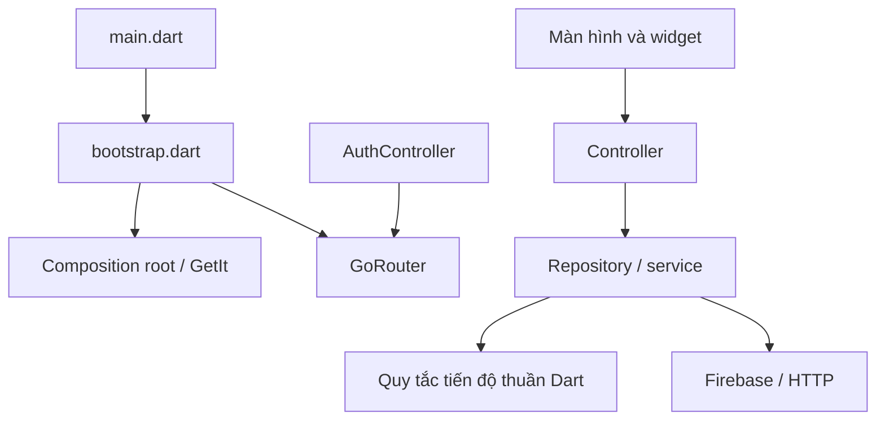

# Kiến trúc Lingua English

## Luồng phụ thuộc

- `main.dart`: gọi bootstrap, khởi chạy UI và hiển thị lỗi khởi động.
- `app/bootstrap.dart`: tải `.env`, Firebase, Hive và dependency.
- `app/app.dart`: UI root nhận router qua constructor; widget test không cần Firebase.
- `app/di/dependency_injection.dart`: nơi duy nhất lắp ghép service, repository và controller.
- `app/routes/*_routes.dart`: khai báo route theo chức năng; `AppRouter` ghép route và áp dụng session guard.
- `presentation/controllers`: trạng thái màn hình và điều phối thao tác, không truy cập Firebase/HTTP trực tiếp.
- `presentation/screens/admin/widgets/admin_lesson_editor.dart`: form và dialog admin, tách khỏi CRUD controller.
- `data/repositories`, `data/datasources/remote`: truy vấn, ánh xạ dữ liệu và thao tác backend.
- `domain/progress/study_progress.dart`: quy tắc tiến độ, ngày học và streak, không phụ thuộc Flutter/Firebase.

## Quyền sở hữu và vòng đời

GetIt quản lý dependency ứng dụng. GetX quản lý controller theo phiên đăng nhập (khởi tạo lười); Provider quản lý controller chat/bạn bè theo route. Không đăng ký cùng một controller ở cả GetIt singleton và GetX. Các factory GetIt cho Provider tạo instance mới, được Provider dispose.

`AuthController` theo dõi UID, hủy controller phiên trước rồi cho router tiếp tục. Quyền admin được đọc một lần mỗi lần đổi UID; đọc lỗi không cấp quyền admin. Khi thay đổi role trên backend trong cùng phiên, cần đăng nhập lại để cập nhật guard. Guard UI không thay thế Firebase Security Rules.

Màn hình dùng `Get.find` cho controller phiên; không `Get.put` trong `build` hoặc `initState`. GoRouter là nơi điều hướng. Thông báo dùng `AppFeedback`/`ScaffoldMessenger`; controller không tự pop màn hình sau khi lưu quiz.

Repository nhận dependency qua constructor. Repository người dùng/bài học lấy UID hiện tại khi bắt đầu thao tác, không lưu UID của lần khởi tạo singleton. Stream bài học được hủy khi đổi bộ lọc hoặc đóng controller. Kết quả bất đồng bộ cũ bị bỏ qua bằng mã thứ tự yêu cầu.

## Truy cập dữ liệu

- Trang chủ dùng một stream hồ sơ người dùng. Refresh đồng thời dùng chung một request.
- Đếm bài học bằng Firestore aggregation, không tải toàn bộ tài liệu chỉ để đếm.
- Hoàn thành bài học và cập nhật bộ đếm người dùng dùng cùng transaction.
- Mở lại bài không đặt `completed` về `false`; học lại không tăng tổng số bài hoàn thành.
- Số lượt học trong ngày vẫn tính mỗi lần hoàn thành. Streak tăng một lần khi vượt mục tiêu; ngày bỏ lỡ làm mất streak.
- Reset ngày nằm cả trong thao tác hoàn thành, không phụ thuộc việc người dùng mở trang chủ trước.
- Thống kê flashcard tận dụng stream bộ thẻ/thư mục đang mở.
- Gửi tin nhắn và cập nhật phòng chat dùng cùng write batch.
- RSS và YouTube nhận HTTP client từ DI; RSS có fallback nguồn, refresh đồng thời được gộp.

## Thêm chức năng

1. Thêm phương thức repository/service với dependency constructor; không import UI vào data.
2. Controller nhận repository qua constructor, công khai trạng thái và thao tác.
3. Đăng ký dependency tại composition root, chọn vòng đời ứng dụng/phiên/route rõ ràng.
4. Màn hình render trạng thái và xử lý điều hướng.
5. Thêm test cho quy tắc nghiệp vụ và các tình huống bất đồng bộ; tránh test phụ thuộc backend thật.

## Phạm vi còn giữ từ dự án cũ

Cấu trúc thư mục vẫn phân lớp, chưa chuyển toàn bộ sang feature-first để tránh di chuyển hàng loạt assets và import không cần thiết. Màn hình auth còn xử lý mã lỗi `FirebaseAuthException`; profile/chat còn đọc thông tin người dùng hiện tại. Model lưu trữ vẫn sử dụng `Timestamp`. AI provider/checker và một số màn hình lớn vẫn cần cải thiện riêng. Những chức năng placeholder (AI route, settings, quiz duel/generate) không được triển khai mới trong refactor này.

Không thay đổi schema, không migrate dữ liệu và không triển khai Firebase rules. Transaction mới cần quyền đọc/ghi các tài liệu tương ứng. Cần kiểm tra luồng đăng nhập, học và CRUD bằng tài khoản thử trên backend trước khi phát hành; unit/widget test và build không xác nhận hành vi backend thật.
